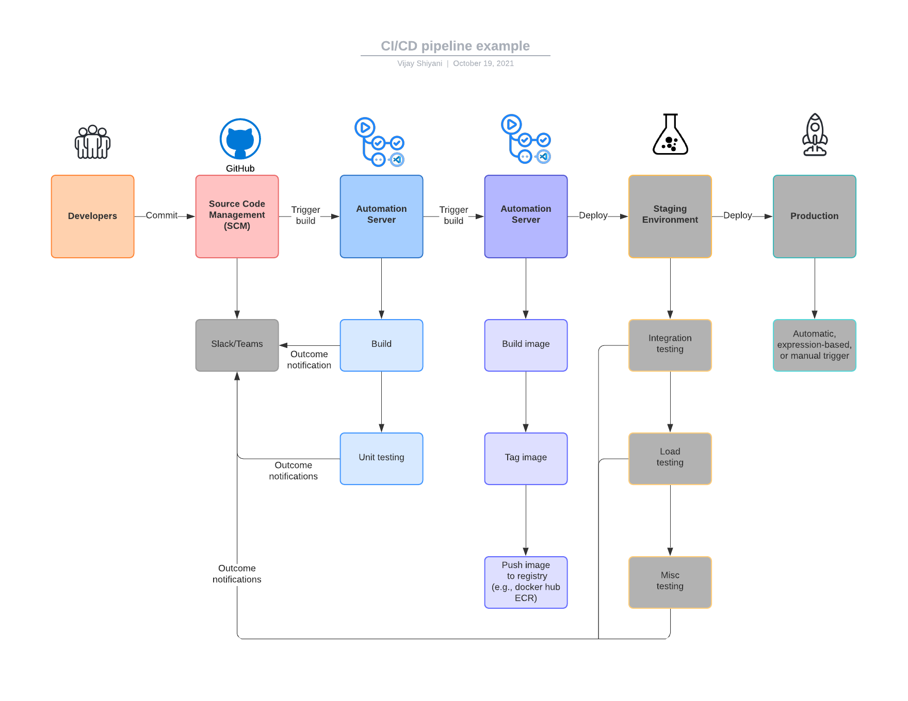

# Sample API project

Simple application which has a single "/version" endpoint build with Node.js/Express
[Nest](https://github.com/nestjs/nest) framework.

Fully containerize using Docker file & Docker compose as a single deployable artifact, encapsulating all dependencies.

CI/CD pipeline build using GitHub Actions

<p align="center">
  
</p>

\*\*Note: All grey boxes are out of scope of this application, such as Slack notificaiton, staging env and production hosting

## 1. Getting started

### 1.1 Requirements

Before starting, make sure you have at least those components on your workstation:

- A [NodeJS](https://nodejs.org/) and NPM
- A [Docker](https://www.docker.com/) and `docker-compose`.

### 1.1 Running the app

```bash

# Start by cloning this project on your workstation.
$ git clone https://github.com/vijayshiyani/sample-containerise-app.git

$ cd sample-containerise-app/

# development mode
$ docker-compose up dev

# OR

# production mode
$ docker-compose up prod


# running test
$ npm run test

```

Navigate to [http://localhost:3000/](http://localhost:3000/) and try out `/version` endpoint http://localhost:3000/#/General/AppController_getVersion

### 1.2 Downloading released production ready versions from Docker hub container registery

```bash

# Docker Pull Command to get latest release
$ docker pull vijayshiyani/assignment

# locally running latest release
$ docker run -p 3000:3000 vijayshiyani/assignment

```

## 2. Approach

- There is only one git branch `main`
- Every pull request or commit to `main` branch triggers Git Actions Node.js CI. It builds the project with node.js 14.X and runs tests
- pull request Merge wont be allowed until all test passes
- To create a new release, a developer must tag commit with with 'vx.x.x'
- Any commit tagged with the above pattern triggers dockerhub_registery Git Actions. It builds new image records the last git commit hash and pushes the latest production-ready image to Docker Hub Container Registry. https://hub.docker.com/r/vijayshiyani/assignment

## 3. Risk associated with application/deployment

- Currently, application tests are run using `ubuntu-latest`, however final applicaiton containers are build using `node:14-alpine` skiny docker image. This can be easily improved by running test inside container.
- Git Actions CI is not as flexible and scalable as Hosted CI such as Jenkins. So complex pipeline will be tricky to create and manage on Git Actions.
- We must keep track on final docker production image size and vulnerabilities introduced by dependicies.
